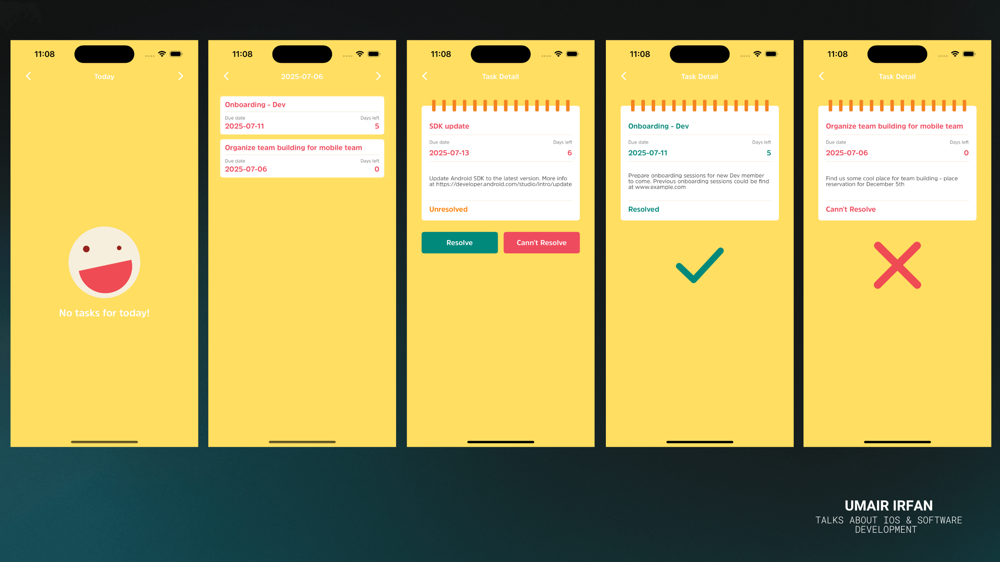

# Smart Tasks
> Smart Tasks is an iOS task management application designed for employees to track and update daily work tasks provided by their manager. 

[![Swift Version][swift-image]][swift-url]
[![Build Status][travis-image]][travis-url]
[![License][license-image]][license-url]

  

The app supports day-to-day task viewing, prioritization, status updates, and commenting.

## Features

- ✅ View daily tasks with status indicators
- 🔁 Navigate to tasks of previous and upcoming days
- 🔝 Automatically sorted by priority and creation time
- 📋 View detailed information for each task including description and due date
- 🟢 Mark tasks as **Resolved** or **Can't Resolve**
- 🔄 Automatically carry unresolved tasks to the next day (within due date)
- 🖼️ Icon representation of task status in task list
- 📅 Offline status and comments handling

## 📐 Architecture

This project follows **MVVM-CR (Model-View-ViewModel with Coordinator and Repository)** Clean Architecture principles:
- ✅ Coordinator (Navigation logic)
- ✅ View (UIKit-based UI)
- ✅ ViewModel (UI logic, Combine publishers)
- ✅ Model (Task, TaskStatus, etc.)
- ✅ Repository (Abstraction layer for data access)

## 🔧 Tech Stack

- 👩‍💻 **Language:** Swift 6.1
- 📱 **Framework:** UIKit
- 📡 **Networking:** `URLSession`
- 🔄 **Reactive Framework:** Combine
- 📦 **Dependency Management:** Swift Package Manager (SPM)
- 🧪 **Testing:** Unit tests using `XCTest`

## 📲 Requirements

- iOS 16.0+
- Compatible Devices: iPhone 16, iPhone 16e, iPhone 16 Pro Max
- Portrait and Landscape orientation supported

## Contribute

I would love for you to contribute to **Smart Tasks**, check the ``LICENSE`` file for more info.
